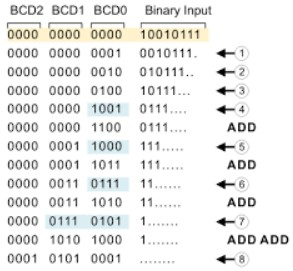
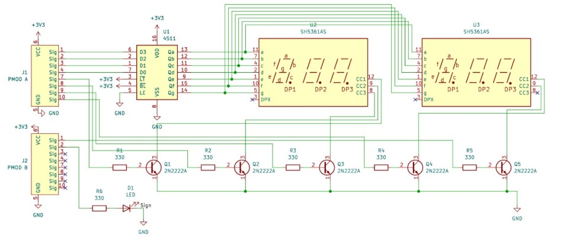
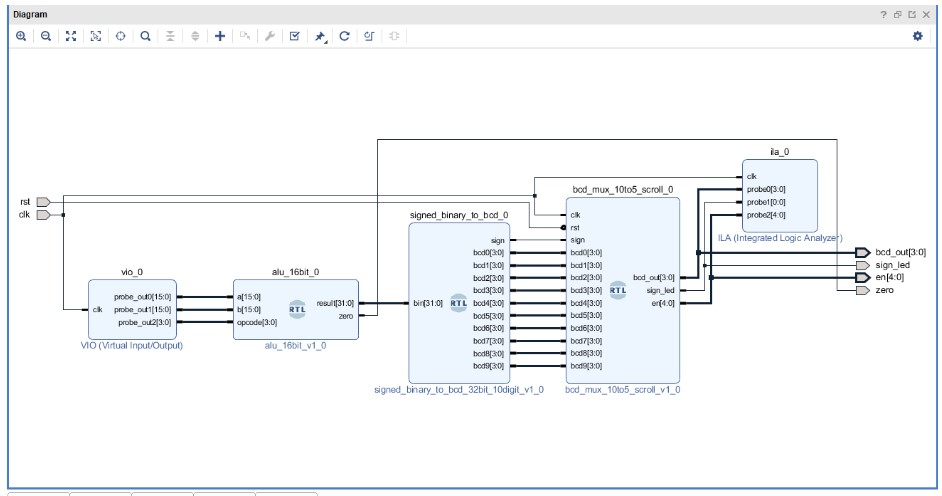
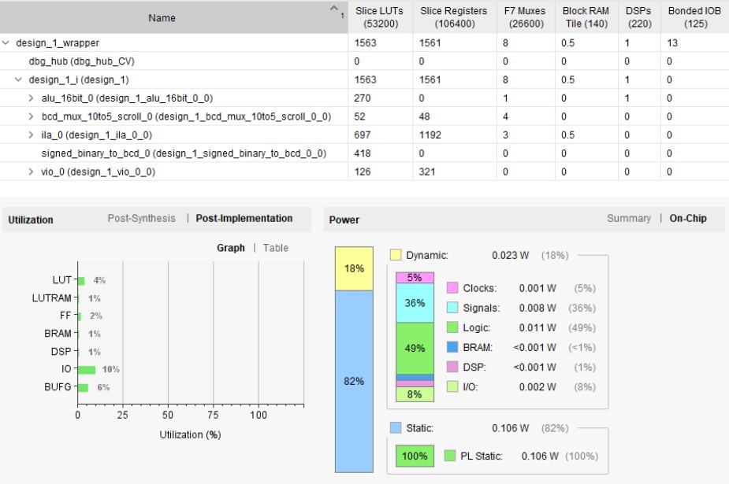

# 16bit-ALU-Verilog-FPGA-PynqZ2

## Overview

This project implements a **16-bit signed Arithmetic and Logic Unit (ALU)** using Verilog HDL on a **PYNQ-Z2** FPGA board with output displayed on 7 segment displays.
The ALU supports **16 operations** including Arithmetic, Logical, Shifting and comparison, selected using a 4-bit opcode.
The binary output is converted to Binary Coded Decimal (BCD) using **Double Dabble Algorithm** and displayed on 7 segment display using **time division multiplexing** and **page scrolling**

## Objectives

* Design a **16-bit signed ALU** capable of performing 16 operations
* Implement arithmetic, logical, and shift operations using Verilog
* Convert binary output to **BCD** for display
* Interface **7-segment displays** using CD4511 decoder
* Verify functionality through simulation and FPGA implementation

## Operation Table

|Opcode|Operation|Expression|
|-|-|-|
|0000|Addition|A + B|
|0001|Subtraction|A − B|
|0010|Multiplication|A × B|
|0011|AND|A \& B|
|0100|OR|A \| B|
|0101|NAND|\~(A \& B)|
|0110|NOR|\~(A \| B)|
|0111|XOR|A ^ B|
|1000|XNOR|\~(A ^ B)|
|1001|Logical Left Shift|A << B\[3:0]|
|1010|Logical Right Shift|A >> B\[3:0]|
|1011|Arithmetic Right Shift|A >>> B\[3:0]|
|1100|Arithmetic Left Shift|A <<< B\[3:0]|
|1101|Increment|A + 1|
|1110|Decrement|A − 1|
|1111|Comparison|A > B / A < B / A = B|

## Tools Used

### Hardware

* PYNQ-Z2 FPGA Board
* CD4511 BCD to 7-Segment Decoder IC (Compatibility with 3.3V FPGA logic levels)
* 7-Segment Displays (Common Cathode)
* 2N2222A NPN Transistors
* 330Ω Resistors

### Software

* Xilinx Vivado
* KiCad (Schematic Design)

## Implementation

### Double Dabble Algorithm

This algorithm is used to convert the binary output result of the ALU into a BCD number which can be given to the decoder IC. The algorithm works in the following way - each 4 bits in the binary number is checked and if it's greater than or equal to 5 then 3 is added to those 4 bits respectively. This checking and updating is done after shifting each bit to the left one after another.

### Time Division Multiplexing

Since we have a limit on the hardware-limited GPIO pins, we have to multiplex the output to the displays we currently have. The segment data from the decoder IC is shorted to all the 5 displays and the enable pins are controlled by an NPN transistor which is in turn controlled by a set of GPIO pins through verilog code. When the enable pin on the FPGA board goes high, the NPN transistor connects the ground to the respective display enable pin which turns on the display (Common Cathode) and the BCD is shown on that particular display. Another purpose of using an NPN transistor is that the FPGA pins directly cannot sink in enough current to drive the displays.  
If we want to visualise all the displays to be turned on at the same time, we have to shift the enable control at a high frequency so that all of them appear to be turned on at the same time. For this purpose, we use **Time Division Multiplexing at a frequency of 200Hz.**
We have 5 displays but our result is a 10 digit BCD number. So we use **page scrolling** in which MSB 5 digits are displayed for 3 seconds and then LSB 5 digits are displayed for 3 seconds. In this way we can overcome the limitation of hardware resources.

### Block Design

### GPIO Pin Mapping

**PMOD A**

|Pin Number|ZYNQ PIN|PIN|
|-|-|-|
|1|Y18|BCD\[3]|
|2|Y19|BCD\[2]|
|3|Y16|BCD\[1]|
|4|Y17|BCD\[0]|
|5|N/C|GND|
|6|N/C|3V3|

**PMOD B**

|Pin Number|ZYNQ PIN|PIN|
|-|-|-|
|1|W14|en\[4]|
|2|Y14|en\[3]|
|3|T11|en\[2]|
|4|T10|en\[1]|
|7|V16|en\[0]|

**Control and Status Signals**

|Signal|ZYNQ PIN|DESCRIPTION|
|-|-|-|
|CLOCK|H16|System clock input|
|RESET|M20|Switch to reset the system|
|Sign LED|R14|Turns on if result is negative|
|ZERO|P14|Turns on if result is zero|

## Results

Post-implementation analysis on the PYNQ-Z2 FPGA shows that the 16-bit ALU design efficiently utilizes hardware resources while supporting all 16 arithmetic and logical operations, BCD conversion, and multiplexed 7-segment display output.

Resource Utilization:

* LUTs: \~4%
* Flip-Flops: \~2%
* BRAM: \~1%
* DSP Blocks: \~1%
* I/O Pins: \~10%

The low utilization indicates an optimized and scalable design with sufficient resources available for future enhancements.

Power Consumption:

* Total On-Chip Power: \~0.129 W
* Static Power: \~82%
* Dynamic Power: \~18%

The design was verified through simulation and hardware testing, and all operations produced correct results on the 7-segment display using BCD conversion and time-division multiplexing.

